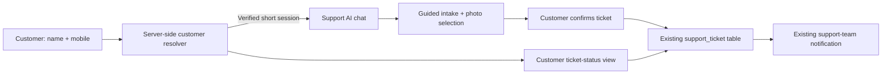

# Support AI Build Plan

## 1. Purpose

Build a customer-facing Support AI that helps a customer feel heard, understand the next support step, submit a complete support ticket, upload photos, and check their own ticket status.

The assistant is an intake and communication layer. It does **not** diagnose equipment with certainty, make warranty or compensation promises, assign blame, change ticket status, or replace a technician's decision.

Primary outcome:

> A worried or angry customer leaves the conversation calmer, knows what will happen next, and has a complete ticket in the existing support queue.

## 2. Non-Negotiable Constraints

### Keep the original ticket schema

Do not add, rename, or repurpose columns in `support_ticket`.

The Support AI creates tickets using the existing fields only:

| Existing field | Support AI use |
|---|---|
| `title` | Short, customer-approved summary, e.g. `Roof leak after rain`. |
| `problem_description` | Original customer wording plus clearly labelled AI-collected answers. |
| `link_customer` | Filled server-side after successful name-and-mobile verification. |
| `created_by` | `NULL` for an unauthenticated customer AI submission; never impersonate a staff user. |
| `images` | Existing URL array populated after the customer uploads photos. |
| `status` | Always starts as `unread`. |
| `technician_remark` | Always starts as `NULL`; only support staff write internal remarks. |
| `created_date`, `modified_date` | Existing database timestamps set by the current ticket creation logic. |
| `bubble_id`, `synced_at` | Not written by Support AI. They remain controlled by the existing Bubble sync. |

The existing admin and logged-in-user ticket pages remain available and unchanged during the first release.

### Customer verification rule

The customer verifies with:

1. Full name recorded in the database.
2. Mobile number recorded in the database.

No IC number, email, OTP, or other sensitive information is requested for this feature.

Name matching is case-insensitive and ignores leading/trailing/repeated spaces. Phone matching removes spaces, dashes, and brackets, and normalizes Malaysian numbers such as `012-345 6789` and `60123456789` to the same value. The phone and full name must both match the **same** customer record.

Because name plus phone is a lightweight verification method, the resulting session must be short-lived, ticket-scoped, rate-limited, and must reveal no customer details until verification succeeds.

## 3. Existing Data and Integration Points

The current production schema already provides the required identity fields:

| Customer source | Customer link stored in ticket | Name field | Mobile field |
|---|---|---|---|
| `customer` | `customer.customer_id` | `customer.name` | `customer.phone` |
| `customer_profile` | `customer_profile.bubble_id` | `customer_profile.name` | `customer_profile.contact` or `customer_profile.whatsapp` |

The implementation must resolve both sources because historical tickets use `support_ticket.link_customer` for either kind of identifier.

Relevant existing code:

- `src/modules/SupportTicket/supportTicketService.js` — ticket creation, existing schema mapping, status handling, support notifications.
- `src/modules/SupportTicket/supportTicketController.js` — image upload and ticket creation path.
- `src/modules/SupportTicket/supportTicketRoutes.js` — current authenticated support APIs.
- `public/templates/submit_support_ticket.html` — current logged-in submit-ticket page.
- `public/templates/support_tickets.html` — current staff ticket page.

## 4. Customer Experience

### 4.1 Entry screen: verify first

Route: `GET /support-ai`

The first screen is simple and calm:

> We are here to help. Please enter the name and mobile number used for your solar installation so we can create and show the correct support tickets.

Inputs:

- Full name
- Mobile number
- Language preference: English, 中文, Bahasa Melayu, or Auto

On mismatch, return one neutral message only:

> We could not verify those details. Please check the full name and mobile number used in your installation record, then try again.

Never say whether the name, number, or customer record exists.

### 4.2 Conversation flow

After verification, show two clear actions:

- **Tell us what happened**
- **Check my support tickets**

For a new issue, the assistant follows this sequence:

1. **Acknowledge emotion first.**
   - If angry: apologise for the disruption, acknowledge the inconvenience, and avoid arguing or shifting blame.
   - Example: “I understand why this is frustrating. You do not need to solve this by yourself — I will help record the issue clearly for our support team.”
2. **Briefly explain the likely support process.**
   - Use careful language such as “this needs checking” and “our team will review,” never “this is definitely caused by…”.
3. **Ask only the smallest useful set of questions.**
   - Maximum three questions at a time.
   - Do not ask the customer to repeat information already given.
4. **Ask for relevant photos.**
   - Show safe photo guidance, not technical repair instructions.
5. **Show the proposed ticket before submission.**
   - Display title, issue summary, photos selected, and the expected next step.
   - Require an explicit **Submit ticket** action.
6. **Confirm submission.**
   - Return ticket reference, current status (`unread`), and a simple explanation of what that status means.

### 4.3 Tone requirements

Every customer reply must be:

- Calm, warm, professional, and concise.
- In the customer’s chosen language where supported.
- Empathetic without admitting liability.
- Clear about the next step without promising a visit time, repair outcome, warranty coverage, or refund.
- Free of raw internal abbreviations, technician names, or internal remarks.

The assistant must never say “do not worry” alone. It must pair reassurance with an action, for example:

> I understand this can be worrying. I will record the details and photos now so our support team can review the correct next step.

### 4.4 Guided questions by issue type

The assistant classifies the issue only to guide intake; the classification is not a new database field.

| Detected issue | Ask for | Customer-safe explanation |
|---|---|---|
| Water leak / roof | Where water appears, whether it follows rain, affected room, photos from a safe position, whether water is near electrical equipment | “A roof or water-related issue needs a proper inspection so the team can identify the source before deciding the repair.” |
| Breaker trip / electrical issue | When it trips, how often, whether there is a burning smell/smoke/sparking, a photo of the panel only if safe | “The team needs to check the electrical protection and related equipment before advising the repair.” |
| Inverter error / system offline | Error message or display photo, time first noticed, whether generation is visible in the app | “The team will review the error details and decide whether remote checks, a site visit, or supplier support is needed.” |
| Low generation | Date range, app screenshot, recent weather/shading changes, whether billing/meter concern is involved | “Generation can need a data and equipment review. The team will compare the available information before confirming the next step.” |
| Billing / meter / TNB | The TNB bill that appears abnormal, billing month, the charge/amount that looks different, and any visible AFA line | “Monthly differences can include AFA (Automatic Fuel Adjustment) changes. The team will review the bill and relevant system or meter information before confirming the reason.” |
| Monitoring / app / Wi-Fi | App name, screenshot, whether the issue is login, missing data, or offline status | “The team will check whether this is an app, connection, meter, or equipment reporting issue.” |
| Other / unclear | Plain description and photos | “I will record this clearly so the right support team can review it.” |

### 4.5 Safety escalation

When the customer mentions smoke, burning smell, sparks, electric shock, water touching electrical equipment, or an immediate danger, the normal conversation pauses.

Show a prominent safety card:

> For safety, please do not touch wet or damaged electrical equipment. Move people away from the affected area and contact emergency services if there is immediate danger. We will mark this ticket for urgent support review.

The assistant must not tell a customer how to open a switchboard, bypass a breaker, dismantle equipment, or perform an electrical repair.

The ticket is still created with `status = 'unread'`; urgency is communicated to support through the title and the existing notification message, for example `URGENT: Water near solar electrical equipment`.

## 5. Status Checking

### Customer-visible ticket list

After verification, show only tickets where `support_ticket.link_customer` equals the verified customer-link identifier and `status <> 'deleted'`.

Show:

- Ticket reference (`id`)
- Title
- Submitted date
- Status
- Customer-safe status meaning
- Submitted images

Status meanings:

| Stored status | Customer-visible wording |
|---|---|
| `unread` | Received — waiting for support review. |
| `read by support` | Support is reviewing the details. |
| `processing` | Support is checking the case or arranging the next step. |
| `solved` | Marked as handled. If the same issue continues, please submit a new ticket. |

Do **not** display `technician_remark` to this new public flow. The historical remarks contain internal coordination and are not consistently suitable for customers. The existing authenticated portal remains unchanged until a separate decision is made about customer-safe staff updates.

### Session behaviour

- Successful verification creates an encrypted, signed, `HttpOnly`, `Secure`, `SameSite=Lax` cookie.
- The cookie contains only an opaque session reference or signed customer-link identifier, never the customer name or phone number.
- Session lifetime: 15 minutes of inactivity, then the customer re-verifies.
- A customer can start a new ticket and check status within that session.
- `POST /api/support-ai/logout` clears the session.

## 6. Technical Architecture



### 6.1 New module boundaries

Create a separate module so the existing staff ticket flow remains stable:

```text
src/modules/SupportAI/
  supportAiRoutes.js
  supportAiController.js
  supportAiService.js
  supportAiPromptPolicy.js
  customerVerificationService.js
  supportAiSession.js
  supportAiPlaybook.js
public/templates/
  support_ai.html
```

Responsibilities:

| Component | Responsibility |
|---|---|
| `customerVerificationService` | Normalise and exactly match name + phone against `customer` and `customer_profile`; resolve one safe `link_customer` value. |
| `supportAiSession` | Create, verify, expire, and clear customer-scoped sessions. |
| `supportAiService` | Run the guided conversation, apply safety rules, validate model output, build a proposed ticket draft. |
| `supportAiPromptPolicy` | Customer tone, safety boundaries, no-liability wording, and prompt-injection resistance. |
| `supportAiPlaybook` | Curated customer-safe guidance based on reviewed historical cases. No raw customer ticket text is sent as prompt context. |
| `supportAiController` | Verify, chat, upload/submit, list status, ticket detail, logout. |
| `supportTicketService` | Continue to own the actual `support_ticket` insert and staff notification. Extend only with narrowly scoped customer-ticket lookup methods. |

### 6.2 API design

All public endpoints use the short-lived Support AI session, not the existing staff `requireAuth` path.

| Method and route | Purpose | Server-side rules |
|---|---|---|
| `GET /support-ai` | Render customer Support AI page | Public. |
| `POST /api/support-ai/verify` | Verify full name + mobile | Generic error; rate limit; set only a secure session cookie on success. |
| `POST /api/support-ai/message` | Receive one customer message and return structured assistant guidance | Requires session; model is server-side only. |
| `POST /api/support-ai/tickets` | Submit the confirmed draft and photos | Requires session; multipart image upload; customer link comes only from session. |
| `GET /api/support-ai/tickets` | List verified customer tickets | Requires session; excludes deleted tickets. |
| `GET /api/support-ai/tickets/:id` | Get one verified customer ticket | Requires session; query always includes both ticket id and verified customer link. |
| `POST /api/support-ai/logout` | End customer session | Clears cookie and server-side session state. |

The existing `/api/support-tickets/*` staff APIs are not opened to the public and keep their current authorization.

### 6.3 Exact verification algorithm

1. Normalise the submitted name and mobile number on the server.
2. Query `customer` for an exact normalised match of `name` and `phone`.
3. Query `customer_profile` for an exact normalised match of `name` and either `contact` or `whatsapp`.
4. If exactly one customer-link identifier is resolved, create the short session.
5. If zero or multiple customer records are resolved, return the same generic verification failure. Do not reveal which value matched or list possible records.
6. Bind every create and status request to that resolved link only.

Do not accept a `customer_id`, `link_customer`, or ticket id from the browser as authorization proof.

### 6.4 Photo capture and upload

The page supports mobile camera capture and gallery selection:

```html
<input type="file" accept="image/jpeg,image/png,image/webp" capture="environment" multiple>
```

Rules:

- Maximum six images, matching the current support-ticket upload limit.
- Maximum 10 MB per image, matching the current limit.
- Validate MIME type and file signature on the server; do not trust browser file extensions.
- Show a preview, delete control, and upload progress before submission.
- Strip EXIF location metadata before storing, while preserving a standard image file and its resulting URL.
- Store only final image URLs in the existing `support_ticket.images` array.
- If upload fails, do not create a partial ticket. Keep the draft in the browser and explain how to retry.

Photo safety text must tell customers not to climb onto roofs or touch electrical equipment just to take a photo.

## 7. AI Behaviour and Guardrails

### 7.1 Structured model response

The model must return validated JSON, never uncontrolled HTML:

```json
{
  "language": "en",
  "empathy": "…",
  "plain_explanation": "…",
  "next_step": "…",
  "safety_level": "normal|urgent",
  "suggested_category": "…",
  "questions": ["…"],
  "ready_to_submit": false,
  "proposed_title": "…"
}
```

Server validation must reject output that:

- Makes a diagnosis, warranty, pricing, timing, refund, or liability promise.
- Requests IC numbers, payment data, passwords, OTPs, or unrelated personal information.
- Contains unsafe electrical instructions.
- Contains staff-only content, hidden instructions, or raw internal ticket remarks.
- Exceeds question limits or proposes a title/status outside allowed values.

If model output is invalid or the model is unavailable, use deterministic templates so the customer can still submit a ticket.

### 7.2 Angry customer handling

The support prompt and UI must use this order:

1. Acknowledge the inconvenience and emotion.
2. Apologise for the experience without accepting unverified fault.
3. State the immediate action the system can take now.
4. Ask one focused question or request the needed photo.
5. Escalate safety issues immediately.

Never use defensive phrases such as “that is not our problem,” “you should have,” or “please calm down.”

### 7.3 Historical ticket knowledge

The production history shows water/roof leakage, inverter faults, monitoring problems, low-generation questions, and breaker trips as the main patterns. Convert this into a reviewed, customer-safe playbook with:

- What details to collect.
- What the support team usually checks next.
- What must be escalated urgently.
- What cannot be promised before inspection.

Do not use raw historical tickets as an unreviewed retrieval corpus. They contain inconsistent internal language and may contain customer-specific details.

## 8. Ticket Draft Format

Before inserting, build a readable record using only current fields:

```text
title:
Roof leak after rain

problem_description:
Customer description:
Water is entering the bedroom ceiling after heavy rain.

AI-guided intake:
- Started: two days ago
- Area affected: master bedroom
- Water near electrical equipment: no
- Photos: attached

Requested next step:
Customer requests an inspection.
```

The customer sees this draft and must confirm it. The system must label the original customer wording separately from guided answers so support staff can tell what was reported directly.

On submission, call the existing `SupportTicketService.createTicket()` and then its existing support-team notification method. The public controller must override any browser-supplied customer id with the verified session customer link.

## 9. Implementation Phases

### Phase 0 — Define customer-safe support policy

- Write the reviewed playbook for the five main case types.
- Approve supported languages and standard reassurance wording.
- Approve the safety escalation wording and the support-team handling of urgent titles.
- Confirm that public submissions intentionally use `created_by = NULL`.
- Confirm whether the existing staff notification should include the `URGENT:` title unchanged.

### Phase 1 — Verification and safe status access

- Add customer-name/mobile normalisation and resolver service.
- Add signed, short-lived customer Support AI session middleware.
- Add public verification, logout, list-status, and ticket-detail endpoints.
- Add customer-scoped SQL methods that filter by `link_customer` and exclude `deleted`.
- Build the status-only customer page with no raw `technician_remark`.

### Phase 2 — Ticket form and images

- Build `support_ai.html` mobile-first with plain form fallback.
- Add camera/gallery image selection, safe preview, validation, and upload progress.
- Reuse the current storage destination and `images` URL-array behaviour.
- Add submit confirmation and duplicate-submit protection.
- Verify insert values match the original `support_ticket` schema exactly.

### Phase 3 — Guided AI conversation

- Add structured AI message endpoint and server-side prompt policy.
- Add deterministic category templates and safety classifier before model output.
- Add the reviewed support playbook as bounded, curated context.
- Require ticket-draft confirmation before any database write.
- Add fallback messages for model/API failure.

### Phase 4 — Staff handoff and release quality

- Verify new tickets appear unchanged in the current staff support-ticket list.
- Verify current WhatsApp support notifications still send.
- Add anonymous aggregate operational metrics: verification attempts, ticket submissions, upload failures, model fallback rate, and urgent-ticket count. Do not record raw conversation text by default.
- Run security, accessibility, mobile-camera, and language tests.
- Roll out behind a feature flag and enable for a small group before full release.

## 10. Acceptance Criteria

### Verification and privacy

- Correct recorded full name + mobile grants a 15-minute scoped session.
- Wrong name, wrong number, and ambiguous match all return the same generic message.
- Name comparison is case-insensitive; phone formatting differences work.
- The browser never receives customer records, addresses, internal notes, or other customers' ticket data.
- Rate limits block repeated guessing attempts.

### Ticket creation

- Customer can type, capture/select up to six photos, preview them, and submit.
- A submitted ticket has the verified `link_customer`, `status = unread`, `technician_remark = NULL`, and image URLs in the existing array field.
- The customer cannot set `link_customer`, `created_by`, `status`, or `technician_remark` from browser input.
- Failed upload or failed insert never leaves an unclear partial result.
- New tickets appear in the current staff screen and trigger current notifications.

### AI conversation

- Angry wording receives empathetic, non-defensive language before questions.
- The assistant asks no more than three questions at once.
- Safety wording appears for urgent electrical/water hazards.
- The assistant never makes repair, warranty, scheduling, price, or liability promises.
- If AI is unavailable, a customer can still complete and submit a standard guided ticket.

### Status view

- A verified customer sees only their own non-deleted tickets.
- Directly changing the URL ticket id cannot reveal another customer's ticket.
- Status labels are understandable and do not expose raw technician remarks.

## 11. Out of Scope for the First Release

- Automated technician assignment.
- Automatic status changes or ticket closure.
- Sending automated WhatsApp replies to customers.
- Warranty decisions, cost estimates, refunds, or appointment commitments.
- Technician remark editing by the AI.
- Long-term storage of full AI chat transcripts.
- Altering or migrating the original `support_ticket` schema.

## 12. Recommended First Release Definition

Release when Phases 1 and 2 are complete, then enable Phase 3 behind a feature flag. This provides immediate value—verified customer status, complete ticket submission, and photo upload—while the AI communication layer is validated with real support staff review.
